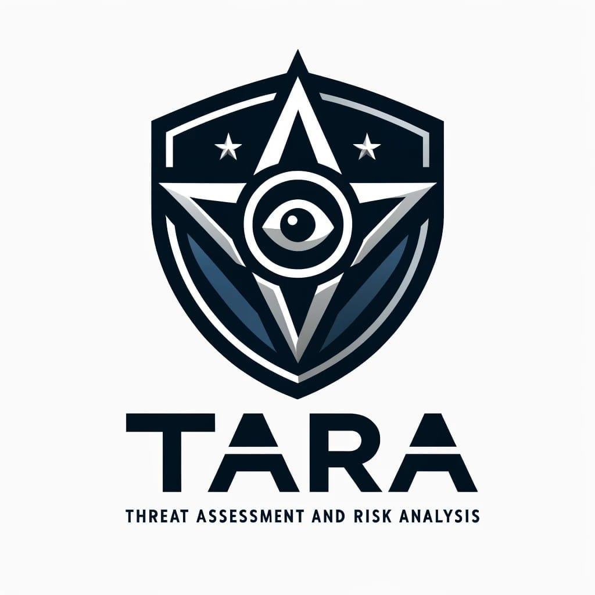

TARA is an AI-powered threat modelling tool that leverages Large Language Models (LLMs) to generate threat models and attack trees for a given application based on the STRIDE methodology. Users provide application details, such as the application type, authentication methods, and whether the application is internet-facing or processes sensitive data. The model then generates its output based on the provided information.


## Features
- Simple and user-friendly interface
- Generates threat models based on the STRIDE methodology
- Generates attack trees to enumerate possible attack paths
- Suggests possible mitigations for identified threats
- Utilises either OpenAI or Mistral models for AI-driven threat analysis
- No data storage; application details are not saved
- Supports models accessed via OpenAI API, Azure OpenAI Service, or Mistral API
- Available as a Docker container image for easy deployment


## Installation

### Option 1: Cloning the Repository

1. Clone this repository:

    ```bash
    git clone https://github.com/ausmanki/Threatsense/Threatsense.git
    ```

2. Change to the cloned repository directory:

    ```bash
    cd Threatsense
    ```

3. Install the required Python packages:

    ```bash
    pip install -r requirements.txt
    ```


## Usage

### Option 1: Running the Streamlit App Locally

1. Run the Streamlit app:

    ```bash
    streamlit run main.py
    ```

2. Open the app in your web browser using the provided URL.

3. Follow the steps in the Streamlit interface to use STRIDE GPT.


## Contributing

Pull requests are welcome. For major changes, please open an issue first to discuss what you would like to change.

